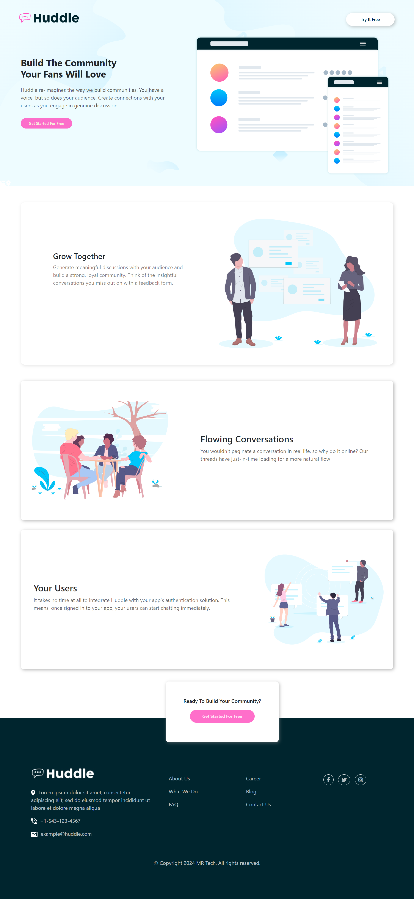

# Frontend Mentor - Huddle landing page with alternating feature blocks


## Welcome! 👋

- [Overview](desktop.png)
  - [Screenshot](desktop.png)
  - [Screenshot](mobile.png)
  - [Links](https://huddle-mrtech.netlify.app/)

## Overview

### Screenshot




### Built with

- Semantic HTML5 markup
- CSS custom properties
- Flexbox
- CSS 
- Bootstrap


### What I learned

Use this section to recap over some of my major learnings while working through this project. Writing these out and providing code samples of areas I want to highlight is a great way to reinforce my own knowledge.


```html
<h1>Some HTML code I'm proud of</h1>
```
```css
.proud-of-this-css {
  color: papayawhip;
}
```

## Author

- Website - [Masud Rana](https://masudprotfolio.netlify.app/)
- Frontend Mentor - [@Masud Rana](https://www.frontendmentor.io/profile/Masud-Rana2001)


